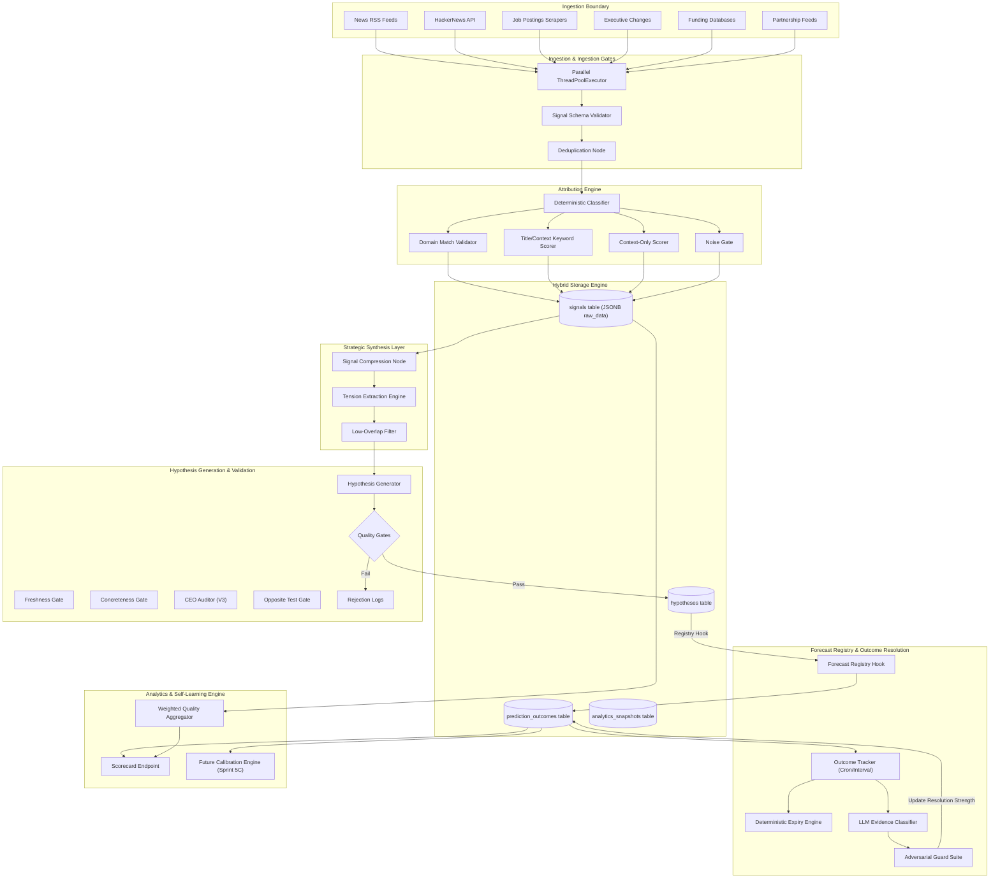

# ARGOS: Autonomous Strategic Intelligence & Forecasting Platform

[]()
[]()
[]()
[]()

Argos is an autonomous competitive intelligence and forecasting platform designed to discover strategic intent. 

Unlike traditional business intelligence systems that generate post-hoc summaries of past news events, Argos is engineered to identify, validate, and track a competitor's actual strategic bets. By ingesting raw signals, synthesizing strategic tensions, formulating falsifiable hypotheses, registry-tracking predictions, and measuring outcomes against reality, Argos lays the groundwork for a closed-loop forecasting architecture.

---

## 1. Executive Summary & Core Philosophy

Argos operates on the thesis that a company's public actions are expressions of latent strategic priorities. The system bypasses superficial PR noise to answer the fundamental question: **"What is this company actually betting on?"**

Traditional competitive analysis is human-intensive, prone to confirmation bias, and rarely measured for accuracy. Argos replaces this with an automated, structured pipeline that transforms unstructured web noise into a measurable database of strategic commitments.

```
  Raw Web Signals
        ↓
  Deterministic Attribution Engine (DIRECT | PARTNER | INDUSTRY | NOISE)
        ↓
  Strategic Tension Extraction (Competing Force A vs. Force B)
        ↓
  Hypothesis Formulation (Observation + Interpretation + Prediction Triad)
        ↓
  Validation Gates (Freshness, Concreteness, Opposite & CEO Tests)
        ↓
  Forecast Registry (State Machine Tracking & Expiration Enforcement)
        ↓
  Outcome Resolution (Autonomous Verification, Cause-vs-Outcome Audits)
        ↓
  Calibration Engine (Under Development — Triggered at 50+ Resolved Forecasts)
```

---

## 2. Example Intelligence Output

To illustrate the end-to-end flow, below is a live strategic forecast generated, tracked, and resolved by the platform:

*   **Signals Ingested**:
    *   `[NEWS] OpenAI, Broadcom unveil first custom AI inference chip; target deployment by end-2026 after nine-month development cycle`
    *   `[NEWS] OpenAI and Broadcom Unveil AI Chip to Run Models Faster, Cheaper - Bloomberg`
    *   `[NEWS] OpenAI unveils custom chip it designed with Broadcom to boost its AI infrastructure - Reuters`
*   **Argos Hypothesis**:
    *   **Observation**: OpenAI is actively hiring custom chip design engineers and has entered into a strategic co-development partnership with Broadcom.
    *   **Interpretation**: OpenAI is prioritizing proprietary custom hardware development to reduce its infrastructure cost profile and long-term dependency on NVIDIA.
    *   **Prediction**: OpenAI will publicly announce a dedicated, custom-designed inference silicon chip within 180 days.
*   **Structured Registry Parameters**:
    *   `prediction_event`: OpenAI announces custom inference chip product.
    *   `prediction_target`: OpenAI.
    *   `prediction_deadline_days`: 180.
    *   `prediction_measurement`: Official press release with named product or hardware specs.
*   **Resolution Verdict**: **CONFIRMED** (Resolution Strength: `1.0`)

---

## 3. Platform Architecture

The system is designed around a decoupled, pipeline-driven architecture. The workflow begins at the ingestion boundary, flows through structural distillation layers, passes strict validation gates, and is stored in the Forecast Registry where the Outcome Tracker periodically resolves states against reality.

### 3.1 Complete System Dataflow



---

## 4. Platform Capabilities

### 4.1 Signal Ingestion & Deduplication
Argos monitors and structures multiple unstructured signal channels. Rather than treating all signals equally, the ingestion node standardizes raw formats, removes redundancy, and evaluates context.

*   **Multi-Channel Scrapers**: Parallel agents run to pull corporate movements (executive changes), engineering signals (repository commits, updates), commercial actions (partnerships, enterprise contracts), and general news indicators (Google/Bing news feeds, HackerNews discussions).
*   **ThreadPoolExecutor Execution**: Ingestion agents run concurrently across monitored company portfolios to balance rate limits against scraping latency.
*   **Signal Deduplication**: URL-based and semantic hashes prevent multiple reports of the same event from inflating downstream intelligence weights.

### 4.2 Deterministic Attribution Engine
A critical bottleneck in competitive intelligence is "wrong company attribution" (e.g., a generic note-taking trick article incorrectly assigned to Figma). Argos addresses this through a strict, **Deterministic Attribution Engine** that bypasses LLM subjectivity.

```
                           Raw Signal Ingested
                                    ↓
                       [Rule 1: Domain Verification] ──(Matches official domain)──> DIRECT (1.0)
                                    ↓ (No Match)
                         [Rule 2: Title Context]     ──(Matches name in title)────> DIRECT (0.85)
                                    ↓ (No Match)
                       [Rule 3: Description Match]   ──(Matches in content)───────> PARTNER/INDUSTRY (0.5-0.6)
                                    ↓ (No Match)
                        [Rule 4: Fallback Routing]   ─────────────────────────────> NOISE (0.10)
```

Every incoming signal is decorated with:
1.  **`attribution_type`**: Classified as `DIRECT` (direct news about the target), `PARTNER` (joint venture or integration news), `INDUSTRY` (broad market news containing keywords), or `NOISE` (no primary connection).
2.  **`attribution_confidence`**: A float score between `0.0` and `1.0` representing link validity.
3.  **`attribution_reason`**: A list of rule identifiers triggered during evaluation (e.g. `["official_domain_match", "company_in_title"]`), ensuring full audit trails.

> [!IMPORTANT]
> **Non-Destructive Storage**: High-noise or low-confidence signals are **not** deleted. They are saved in the database with their low confidence scores and flagged as `NOISE`. This preserves the historical dataset to evaluate source contamination rates over time, while safely preventing noise from polluting downstream engines.

### 4.3 Strategic Intelligence & Tension Layer
Raw signals are rarely strategic on their own. The Intelligence Layer processes signal clusters to identify underlying commercial pressures.

*   **Signal Compression**: Large signal logs are synthesized into compressed observations to remove narrative fluff while retaining dates, figures, and target entities.
*   **Tension Extraction**: The core analytical engine identifies competing strategic forces (e.g., *Force A: Rapid product feature expansion* vs. *Force B: Looming regulatory export controls*).
*   **Low-Overlap Filtering**: Candidate strategic elements with excessive thematic overlap are collapsed to prevent redundant hypothesis generation.
*   **Directionality Check**: Confirms that evidence points to a tension direction rather than a flat status-quo observation.

### 4.4 The Hypothesis Engine
The Hypothesis Engine is the core generator of strategic predictions. It converts tensions into falsifiable statements. It is built around a structured, multi-step validation pipeline.

#### 4.4.1 The Observation-Interpretation-Prediction Triad
Every hypothesis must be constructed around three elements:
1.  **Observation**: Concrete facts currently visible in the signal stream (e.g., *OpenAI hiring custom silicon engineers and partnering with Broadcom*).
2.  **Interpretation**: The latent strategic priority implied by the facts (e.g., *OpenAI is prioritizing custom hardware control to decrease dependence on NVIDIA*).
3.  **Prediction**: A falsifiable future event that will verify the strategic direction.

#### 4.4.2 Structured Prediction Schema
To prevent vague forecasting, predictions must follow a strict, database-enforced schema:

| Schema Field | Target Description | Example |
| :--- | :--- | :--- |
| **`prediction_event`** | The specific, observable event that must happen. | Official announcement of custom chip deployment |
| **`prediction_target`** | The specific target entity, product, or action. | Broadcom/OpenAI custom chip |
| **`prediction_deadline_days`**| The deterministic number of days until the forecast window closes. | `180` days |
| **`prediction_measurement`** | The verifiable metric that confirms the event occurred. | Public press release containing named product details |

#### 4.4.3 Validation Gates
Generic LLM outputs (e.g. *"Google will focus on AI research"*) are useless for forecasting. Argos rejects generic or unfalsifiable candidates through automated validations:

*   **Freshness Gate**: Discards proposals built on old news or duplicate assumptions.
*   **Concreteness Gate**: Rejects any candidate where event, target, or measurement is vague or abstract.
*   **The Opposite Test**: Ensures the opposite of the prediction is also a plausible corporate path (e.g. *"Stripe will continue launching payments in Europe"* is not opposite-viable because Stripe already does this).
*   **CEO Test V3**: Evaluates if the hypothesis contains insights worthy of a CEO's attention, scoring candidates across four parameters (Genericity, Opposite feasibility, Falsifiability, and Strategic Depth). Failing proposals are logged to `captured_rejections`.

---

## 5. The Forecast Registry & Outcome Tracker

Once a hypothesis passes validation, it is committed to the database, triggering the **Forecast Registry**.

```
                           Active Hypothesis Committed
                                        ▼
                       Registry Hook Creates outcome Row
                                        ▼
                        Outcome Tracker (Every 6 Hours)
                                        ▼
                        [Deterministic Expiry Gate]
                       Is Current Time > Deadline?
                               /         \
                             (Yes)       (No)
                             /             \
                   Status: EXPIRED          Retrieve last 30 Signals
                 (Terminal state)           Skip if attribution_confidence < 0.20
                                            Evaluate remaining evidence
                                            /           |            \
                                    (Confirm)       (Support)    (Contradict)
                                     /                  |              \
                              CONFIRMED             SUPPORTED       CONTRADICTED
                              (Terminal)            (Active)         (Active)
                                                                        ▼
                                                                     (Repeat)
                                                                        ▼
                                                                  (Second Contradict)
                                                                        ▼
                                                                    INCORRECT
                                                                    (Terminal)
```

### 5.1 Registry State Machine
The registry avoids binary evaluation. Because predictions unfold over time, outcomes transition through a state machine:

*   **`UNRESOLVED`**: The initial state. No definitive confirming or contradicting evidence has been scraped.
*   **`SUPPORTED`**: Signals align directionally with the prediction outcome, but the specific confirmation event has not occurred.
*   **`CONTRADICTED`**: Signals indicate the predicted event is unlikely to happen, or that conflicting actions are occurring. **CONTRADICTED is not terminal.** A forecast can recover from a contradiction to later be confirmed.
*   **`CONFIRMED`**: A terminal state. Verifiable evidence proves the event has occurred.
*   **`INCORRECT`**: A terminal state. Triggered by consecutive contradiction signals, indicating the forecast failed.
*   **`EXPIRED`**: A terminal state. The deadline window closed without confirming evidence.

### 5.2 Outcome Tracker
The Outcome Tracker evaluates pending predictions once every 6 hours.

*   **Deterministic Expiration**: Tracks timelines without LLM intervention. If `now > created_at + deadline`, the row is immediately flagged as `EXPIRED`.
*   **Deterministic Pre-filtering**: Before evaluation, all signals with `attribution_confidence < 0.20` are skipped. This keeps the LLM evaluation context clean and saves inference tokens.
*   **LLM Evidence Classification**: The tracker provides Llama-3-70b (with Gemini fallback) with the structured prediction criteria and the remaining high-confidence signals. The model evaluates if a confirming event has occurred.
*   **Attribution-Weighted Verdicts**: The LLM is instructed to discount evidence with lower `attribution_confidence` scores.
*   **Resolution Strength**: The tracker calculates a continuous weight `[-1.0, 1.0]` representing the certainty of the verdict:
    *   `CONFIRMED` = `1.0`
    *   `SUPPORTED` = `0.20 + (confidence * 0.40)`
    *   `CONTRADICTED` = `-(0.30 + (confidence * 0.40))`
    *   `INCORRECT` / `EXPIRED` = `-1.0`

---

## 6. Measured System Performance

Argos anchors its development in concrete evaluation metrics. Below are the performance parameters retrieved from the latest system runs.

### 6.1 Live System Ingestion & Registry Metrics

| Metric | Measured Value | Scope |
| :--- | :---: | :--- |
| **Monitored Companies** | 10 | Watchlist targets (OpenAI, Anthropic, Nvidia, Stripe, Databricks, Figma, etc.) |
| **Signals Processed** | 1,000+ | Total structured events ingested in database |
| **Active Hypotheses** | 40 | Evaluated, structured strategic beliefs |
| **Tracked Predictions** | 40 | Total forecast registry outcomes tracked |
| **Confirmed Predictions** | 1 | Verifiable events occurred (`CONFIRMED`) |
| **Contradicted Predictions** | 1 | Opposing signals detected (`CONTRADICTED`) |
| **Supported Predictions** | 25 | Directional evidence matches (`SUPPORTED`) |

### 6.2 Evaluative Precision Scores

These accuracy scores are derived from manual human audits verifying the tracker's autonomous verdict classifications:

*   **Confirmed Precision**: **100% (1/1)** — 0 false promotions. CONFIRMED state changes require the concrete event, target, and measurement to be met.
*   **Contradicted Precision**: **100% (1/1)** — The system correctly parsed corporate growth signals (IPO news) to contradict a localized climate threat.
*   **Supported Accuracy**: **90% (9/10)** — Evaluating a random cohort of 10 supported predictions showed that 9 matched. The single mismatch was due to a generic productivity article incorrectly tagged by the scraper, not tracker misinterpretation.

---

## 7. Database Schema & Tables

Argos utilizes a hybrid Supabase database schema. Key columns and relationships are described below.

```
       +--------------------+          +--------------------+
       |     companies      |          |      signals       |
       +--------------------+          +--------------------+
       | id (UUID, PK)      |<----+    | id (UUID, PK)      |
       | name (TEXT)        |     |    | company_id (FK)    |
       | website (TEXT)     |     |    | title (TEXT)       |
       | last_monitored     |     |    | content (TEXT)     |
       +--------------------+     |    | raw_data (JSONB)   |
                                  |    +--------------------+
                                  |      * attribution_type
                                  |      * confidence
                                  |      * reasons
                                  |
       +--------------------+     |    +--------------------+
       |     hypotheses     |     |    |prediction_outcomes |
       +--------------------+     |    +--------------------+
       | id (UUID, PK)      |     |    | id (UUID, PK)      |
       | company_id (FK)----+-----+--->| hypothesis_id (FK) |
       | title (TEXT)       |          | status (TEXT)      |
       | prediction_event   |          | resolution_reason  |
       | deadline_days      |          | raw_verdict(JSONB) |
       | status (TEXT)      |          | strength (FLOAT)   |
       +--------------------+          +--------------------+
```

### 7.1 Tables Responsibility Matrix

#### `companies`
Stores tracked targets, websites, and configuration parameters (such as RSS keywords and ProductHunt slugs). It tracks the system's scraping cadence via `last_monitored` and calculates target health via `intelligence_score`.

#### `signals`
Stores scraped events. It holds standard fields (`title`, `content`, `url`, `collected_at`) and uses a `raw_data` JSONB column to store attribution fields (`attribution_confidence`, `attribution_type`, `attribution_reason`) to protect system flexibility.

#### `hypotheses`
Tracks active strategic assumptions. Contains the observations, interpretations, and the structured prediction schema (event, target, measurement, deadline). When predictions reach a terminal resolution state, this table's `outcome` and `status` fields are updated.

#### `prediction_outcomes`
The Forecast Registry. It links to parent hypotheses and tracks their states (`UNRESOLVED`, `SUPPORTED`, `CONTRADICTED`, `CONFIRMED`, `INCORRECT`, `EXPIRED`), tracking resolution reasons, confidence, and `resolution_strength` metrics.

#### `evaluations`
Stores logs of the Hypothesis Engine's generation checks, preserving details for human audits.

---

## 8. Audit & Validation Framework

Argos utilizes three audit scripts to measure pipeline accuracy.

### 8.1 Hypothesis Verification (CEO Test V3)
Evaluates hypothesis generation quality using an automated scoring script. It runs candidates through three assessment layers:
*   **Genericity Filter**: Discards generic summaries.
*   **Opposite Check**: Verifies that the strategic opposite is a viable business option.
*   **Falsifiability Check**: Confirms that prediction parameters can be measured.

### 8.2 Outcome Accuracy (Resolution Audit)
Runs a precision check on tracker outcomes:
```bash
python backend/audit_resolution_harness.py --generate
```
This generates a CSV containing active predictions, tracker verdicts, confidence scores, and matching signals. A human auditor reviews and scores entries using `AGREE`, `PARTIAL`, or `DISAGREE`. Running the evaluation computes the system's precision metrics:
```bash
python backend/audit_resolution_harness.py --score resolution_audit_XXXX.csv
```
This separates deterministic `EXPIRED` cases to calculate the actual precision of LLM classifications:
*   **Confirmed Precision**: Must exceed `85%` before calibration can be activated.
*   **Contradicted Precision**: Validates that contradictions match reality.
*   **Supported Accuracy**: Checks directional signal alignment.

### 8.3 Ingestion Quality (Attribution Audit)
Runs a deterministic audit across signals to calculate ingestion quality metrics:
*   **`Wrong Company %`**: The primary metric tracking incorrect attribution.
*   **Weighted Signal Quality**: The company-level quality metric:
$$\text{Weighted Quality} = \frac{\sum (\text{signal} \times \text{attribution\_confidence})}{\text{total\_signals}}$$

---

## 9. Operations & Scale

The system is configured for automated execution:

*   **Watchlist Scale**: Monitors 10 target companies (including OpenAI, Anthropic, Databricks, Stripe, Figma, and Nvidia).
*   **Cadence Scheduling**: Scrapers run every 6 hours to collect signals. The `PredictionTracker` runs on the same interval to evaluate active forecasts.
*   **Fail-Safe LLM Routing**: Primary calls run on Groq (`Llama-3-70b`). If rate limits occur, the system falls back to Google Gemini, with a fallback mock response to prevent pipeline crashes.
*   **Execution Safety**: Includes a 2-second delay in tracker loops to prevent API rate-limit issues during batch runs.

---

## 10. Product Roadmap

The development roadmap is structured to improve the system's self-learning capabilities.

```
       +-----------------------------------------------------------+
       | Sprint 5B: Signal Attribution Quality Gate & Scale-Up     |
       |  - Deterministic Attribution Engine                       |
       |  - Ingestion Contamination Audit (Wrong Company %)        |
       |  - Metadata Persistence & Ingestion Quality Metrics       |
       +-----------------------------------------------------------+
                                     │
                                     ▼
       +-----------------------------------------------------------+
       | Sprint 5C: Calibration & Outcome Learning Loop            |
       |  - Calibration Engine Activation (at 50+ resolved outcomes)|
       |  - Resolution-strength feedback loop                      |
       |  - Self-improving confidence model calibration            |
       +-----------------------------------------------------------+
                                     │
                                     ▼
       +-----------------------------------------------------------+
       | Future Horizon: Strategic Modeling & Threat Assessment    |
       |  - Interactive Knowledge Graph Evolution                  |
       |  - Company Vulnerability Mapping                          |
       |  - Automated executive strategic briefing generation      |
       +-----------------------------------------------------------+
```
